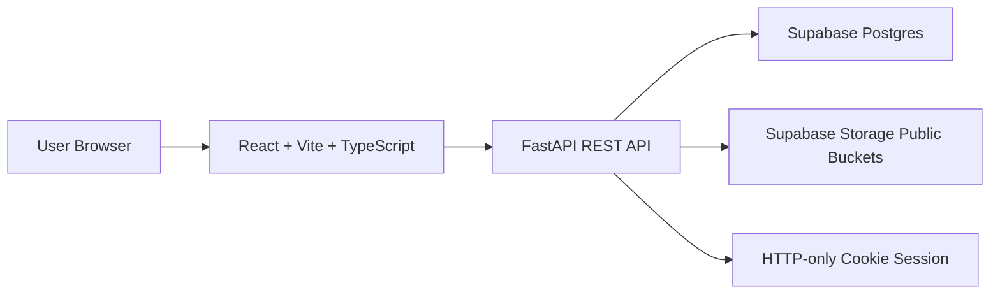

# FZU Campus Community Architecture

## 1. Architecture Overview

The project is a monorepo with a React frontend, FastAPI backend, Supabase Postgres database, and Supabase Storage media layer.

The frontend never writes directly to Supabase. It communicates with the FastAPI backend through REST APIs. The backend owns authentication, authorization, validation, business rules, database writes, and Storage uploads.



## 2. Repository Structure

The project uses a monorepo:

```text
ShowFZU/
  frontend/
  backend/
  docs/
    requirements.md
    architecture.md
  resource/
```

Directory responsibilities:

- `frontend/`: React + Vite + TypeScript application.
- `backend/`: Python + FastAPI service.
- `docs/`: formal project requirements and technical design.
- `resource/`: raw Word documents, videos, source images, and future official FZU guide material.

## 3. Technology Stack

Frontend:

- React
- Vite
- TypeScript
- Browser Router

Backend:

- Python
- FastAPI
- SQLAlchemy
- Alembic
- Supabase Python client for Storage

Database:

- Supabase Postgres

File storage:

- Supabase Storage
- Public buckets for images, videos, thumbnails, and avatars

Authentication:

- Custom backend authentication
- HTTP-only cookie session
- 7-day session lifetime

## 4. Supabase Boundary

Supabase Postgres:

- Stores relational application data.
- Accessed by backend through SQLAlchemy.
- Schema managed by Alembic.

Supabase Storage:

- Stores avatars, post images, post videos, generated video thumbnails, default covers, and processed official guide assets.
- Accessed by backend through Supabase client.
- Uses public buckets because post media, avatars, and public pages are visible to guests.

Supabase Auth:

- Not used.
- The project requires custom Account ID, username login, and custom security question recovery.

Frontend direct Supabase access:

- Not used for database writes.
- Not used for Storage writes.
- Frontend receives public URLs from backend-managed records.

Current Supabase project:

- Project ref / ID: `epkgspfhfwlsxsesteof`.
- Project status: `ACTIVE_HEALTHY`.
- Project URL: `https://epkgspfhfwlsxsesteof.supabase.co`.
- The backend should use this project for Supabase Postgres and Supabase Storage integration.
- Do not commit Supabase service role keys, database passwords, session secrets, or other credentials to the repository.
- Store credentials in backend environment variables and local `.env` files that are excluded from version control.

## 5. Authentication Architecture

The backend owns authentication.

Registration flow:

1. User submits Account ID, username, password, confirm password, custom security question, and answer.
2. Backend validates Account ID format and uniqueness.
3. Backend validates username format and uniqueness.
4. Backend validates password strength and confirmation.
5. Backend hashes password and security answer.
6. Backend creates user row.
7. Backend returns success.

Login flow:

1. User selects login method: `account_id` or `username`.
2. User submits the selected login method, identifier value, and password.
3. Backend resolves the identifier only against the selected field.
4. In `account_id` mode, backend validates the 8 to 12 digit Account ID format before lookup.
5. In `username` mode, backend treats the value as a username and does not infer Account ID semantics from numeric shape.
6. Backend verifies password.
7. Backend creates a 7-day session.
8. Backend sets HTTP-only cookie.
9. Frontend calls current-session endpoint to hydrate user state.

Session behavior:

- Cookie is HTTP-only.
- Cookie should be secure in production.
- Logout clears cookie and invalidates server-side session.
- Refreshing the page keeps login state if session is valid.

Password recovery:

1. User enters Account ID.
2. Backend returns the user's custom security question if Account ID exists.
3. User submits security answer and new password.
4. Backend validates answer and password policy.
5. Backend updates password hash.

## 6. Core Data Model

Recommended table names are initial design targets and can be refined during implementation.

### users

Purpose:

- Stores account identity, public profile, and credential data.

Important fields:

- `id`: internal immutable public-safe user ID, used in URLs.
- `account_id`: 8 to 12 digit unique immutable login ID.
- `username`: unique editable public display name.
- `password_hash`
- `security_question`
- `security_answer_hash`
- `avatar_url`
- `avatar_storage_path`
- `bio`
- `created_at`
- `updated_at`

Indexes and constraints:

- Unique `account_id`.
- Unique `username`.
- Check Account ID format.
- Check username length.

### sessions

Purpose:

- Stores backend sessions for HTTP-only cookie auth.

Important fields:

- `id`
- `user_id`
- `session_token_hash`
- `expires_at`
- `created_at`
- `revoked_at`

### posts

Purpose:

- Stores user-generated campus stories.

Important fields:

- `id`: internal immutable post ID, used in URLs.
- `author_id`
- `title`
- `body`
- `category`
- `cover_url`
- `cover_source`
- `published_at`
- `updated_at`

Constraints:

- Title required.
- Category must be one of the 6 fixed categories.
- A post must have body, image, or video.

### post_media

Purpose:

- Stores image and video records attached to posts.

Important fields:

- `id`
- `post_id`
- `type`: image or video.
- `url`
- `storage_path`
- `thumbnail_url`
- `thumbnail_storage_path`
- `mime_type`
- `size_bytes`
- `sort_order`
- `created_at`

Rules:

- Images have sortable order.
- At most 1 video per post.
- Each image <= 10MB.
- Video <= 25MB.
- Total media size per post <= 200MB.

### comments

Purpose:

- Stores main comments and one-level replies.

Important fields:

- `id`
- `post_id`
- `author_id`
- `parent_id`
- `body`
- `is_deleted`
- `created_at`
- `deleted_at`

Rules:

- `parent_id` is null for main comments.
- Replies can only target main comments.
- Replies cannot target replies.
- Deleted comments remain as placeholder rows.

### likes

Purpose:

- Stores post likes.

Important fields:

- `id`
- `post_id`
- `user_id`
- `created_at`

Constraints:

- Unique `(post_id, user_id)`.

### favorites

Purpose:

- Stores post favorites.

Important fields:

- `id`
- `post_id`
- `user_id`
- `created_at`

Constraints:

- Unique `(post_id, user_id)`.

### official_guide_items

The official guide can be stored as static JSON rather than database rows.

Recommended static fields:

- `id`
- `name`
- `description`
- `atmosphere`
- `imageUrl`
- `imageAlt`
- `sortOrder`

## 7. Categories

Categories are fixed enum values:

- `Campus Landmark`
- `Study Space`
- `Student Life`
- `Food and Cafe`
- `Sports and Leisure`
- `Digital Memory`

Category metadata should live in frontend static config or shared JSON:

- Name
- Short English description
- Representative image URL
- Route slug

The database stores the canonical category name or a stable enum value. The API should expose frontend-ready label and route information.

## 8. REST API Shape

Final endpoint names can be adjusted during implementation, but the API should follow these resource boundaries.

### Auth

- `POST /auth/register`
- `POST /auth/login`
- `POST /auth/logout`
- `GET /auth/me`
- `POST /auth/forgot-password/start`
- `POST /auth/forgot-password/reset`
- `POST /auth/change-password`

`POST /auth/login` request body should include:

- `login_method`: enum `account_id` or `username`.
- `identifier`: Account ID value or username value, interpreted according to `login_method`.
- `password`.

### Users

- `GET /users/{user_id}`
- `GET /users/{user_id}/posts`
- `GET /me`
- `PATCH /me/profile`
- `POST /me/avatar`
- `DELETE /me/avatar`
- `GET /me/posts`
- `GET /me/favorites`
- `GET /me/likes`

### Posts

- `GET /posts`
- `POST /posts`
- `GET /posts/{post_id}`
- `PATCH /posts/{post_id}`
- `DELETE /posts/{post_id}`

Query support for `GET /posts`:

- `q`: search title, body, author username.
- `category`: filter by category.
- `page` or cursor pagination to be finalized.
- Default sort: latest first.

### Media

For MVP, media can be handled inside post create and update multipart requests.

Possible dedicated endpoints if needed:

- `POST /posts/{post_id}/media`
- `PATCH /posts/{post_id}/media/order`
- `DELETE /posts/{post_id}/media/{media_id}`

### Likes And Favorites

- `POST /posts/{post_id}/like`
- `DELETE /posts/{post_id}/like`
- `POST /posts/{post_id}/favorite`
- `DELETE /posts/{post_id}/favorite`

The frontend can present these as toggle actions while the backend keeps idempotent resource semantics.

### Comments

- `GET /posts/{post_id}/comments`
- `POST /posts/{post_id}/comments`
- `POST /comments/{comment_id}/replies`
- `DELETE /comments/{comment_id}`

Delete performs soft delete placeholder behavior.

### Static Official Guide

The official guide can be served by the frontend as static JSON/assets:

- No backend endpoint is required for MVP.

If asset hosting later moves to Storage, the backend can expose a read-only metadata endpoint.

## 9. Media Upload Architecture

Upload path:

1. Frontend sends files to FastAPI.
2. FastAPI validates authentication and authorization.
3. FastAPI validates file type, file size, and total post media size.
4. FastAPI uploads accepted files to Supabase Storage.
5. FastAPI stores public URL and storage path in Postgres.
6. FastAPI returns post or media data to frontend.

Post media validation:

- Image types: png, jpg, jpeg, gif.
- Video types: mp4, webm, ogg, mov.
- Image size <= 10MB.
- Video size <= 25MB.
- Total media size per post <= 200MB.
- At most 1 video per post.

Avatar validation:

- Types: jpg, jpeg, png.
- Size <= 2MB.

Video thumbnails:

- Capture middle frame.
- Store thumbnail in Supabase Storage.
- Save public thumbnail URL in `post_media`.

Cover calculation:

1. First image by `sort_order`.
2. Video thumbnail if no image exists.
3. Default cover if no media exists.

Storage deletion:

- When a post is deleted, delete associated media files and thumbnails from Storage.
- When a post image is removed, delete that image file from Storage.
- When a video is replaced or deleted, delete old video and old thumbnail from Storage.
- When an uploaded avatar is replaced or deleted, delete old avatar file from Storage.

## 10. Frontend Architecture

Frontend app responsibilities:

- Browser Router page routing.
- HTTP API calls to FastAPI.
- Session hydration through `/auth/me`.
- Login redirect and return URL handling.
- Form validation mirroring backend rules.
- Media upload progress and error display.
- Responsive layout for desktop, tablet, and mobile.

Suggested page groups:

- `HomePage`
- `CategoriesPage`
- `CategoryPage`
- `PostDetailPage`
- `CreatePostPage`
- `EditPostPage`
- `SearchResultsPage`
- `LoginPage`
- `RegisterPage`
- `ForgotPasswordPage`
- `ResetPasswordPage`
- `PublicAuthorPage`
- `ProfilePage`
- `MyPostsPage`
- `MyFavoritesPage`
- `MyLikesPage`
- `OfficialGuidePage`

Suggested shared components:

- `AppShell`
- `TopNav`
- `SearchBox`
- `PostCard`
- `PostFeed`
- `CategoryCard`
- `CategoryTabs`
- `MediaCarousel`
- `CommentThread`
- `Avatar`
- `ProtectedRoute`
- `UploadField`

## 11. Official Guide Build Pipeline

Official guide source material should be processed during development.

Input:

- Word files in `resource/` that contain English building names, English introductions, and embedded photos.
- Primary text source: `FZU_Campus_Architecture.docx - 福州大学校园建筑Word文档.docx`.
- Supplemental text/photo source: `照片（图书馆，卧龙桥，旋转楼梯，东门）.docx`.
- Main reusable image candidate folder: `resource/FZU_Images_Collection.zip - 福州大学图片合集压缩包/fzu_images/`.
- The image collection folder currently includes building, gate, library, Fuyou Pavilion, campus lake, campus fountain, and logo candidates.

Output:

- Static JSON file for page data.
- Extracted image assets.
- Optional optimized image variants for web display.

Asset review output:

- A candidate inventory listing extracted image path, source document, dimensions, aspect ratio, file size, and associated building text when available.
- A selected hero image record.
- A selected ordered list of official guide items.
- A rejected-candidates note for images excluded because of watermark, low resolution, poor crop, unclear subject, or missing metadata.

Recommended output location:

```text
frontend/src/data/officialGuide.json
frontend/src/assets/official-guide/
```

Runtime behavior:

- React page imports or fetches the static JSON.
- Page renders static photography exhibition layout.
- No backend writes.
- No search indexing.
- No interaction APIs.

Selection workflow:

1. Extract Word media and nearby text into a reviewable intermediate inventory.
2. Scan the reusable image candidate folder and record dimensions, aspect ratio, file size, and decode status.
3. Match each official guide item to its English building name and introduction from the Word sources.
4. Treat standalone image-folder files as visual candidates that must be mapped to a guide item before final use.
5. Filter out images with watermarks, visible source-site marks, severe compression, low clarity, unclear building identity, or failed decode status.
6. Score remaining candidates for architectural clarity, composition, lighting, resolution, responsive crop safety, and fit with the photography exhibition style.
7. Select one distinct official guide hero image and one best image per building item.
8. Generate optimized web assets from selected images only.
9. Write `officialGuide.json` with stable item IDs, names, descriptions, atmosphere text, image URLs, alt text, and sort order.

Current review notes:

- `FZU_Campus_Architecture.docx - 福州大学校园建筑Word文档.docx` contains 6 official architecture/campus entries and 6 usable embedded images.
- `照片（图书馆，卧龙桥，旋转楼梯，东门）.docx` contains 4 supplemental official entries and 16 usable embedded images, excluding a 1x2 placeholder image.
- `FZU_Images_Collection.zip - 福州大学图片合集压缩包/fzu_images/` contains 20 JPG candidates and 3 logo PNGs.
- `building_6.jpg` and `campus_sunset.jpg` currently fail local image decoding and should be excluded unless repaired.
- The available material is sufficient for an MVP official guide page with 6 to 10 curated sections.

Recommended scoring dimensions:

- `subjectClarity`: the building or campus space is immediately identifiable.
- `composition`: the frame has a strong focal point and clean foreground/background.
- `resolution`: the source can support large desktop and mobile display without obvious softness.
- `cropSafety`: the important subject survives desktop wide crops and mobile vertical crops.
- `officialTone`: the image feels formal, polished, and suitable for an official FZU introduction page.
- `uniqueness`: the selected set avoids repeating the same angle or visual mood too often.

## 12. Demo Data Pipeline

Existing Word documents in `resource/` are the source of initial demo posts.

Demo import should:

- Extract English titles, categories, body content, and linked media.
- Normalize categories to the 6 fixed categories.
- Convert former `Library` examples to `Study Space`.
- Compress oversized demo videos before inclusion.
- Generate video thumbnails from middle frames.
- Insert demo users, posts, media, comments, likes, and favorites as needed for testing.

Demo videos must follow the same 25MB video limit as user uploads.

## 13. Security And Validation

Backend must enforce all important rules even if frontend validates first.

Backend validation includes:

- Account ID format and uniqueness.
- Username format and uniqueness.
- Password strength.
- Authentication for restricted endpoints.
- Ownership for profile editing, post editing, post deletion, and comment deletion.
- Upload MIME type and extension.
- File size limits.
- Total post media size limit.
- Single-video-per-post rule.
- Comment depth limit.

Security notes:

- Store password hashes, not plain passwords.
- Store security answer hashes, not plain answers.
- Use HTTP-only cookies.
- Use secure cookies in production.
- Sanitize user-provided filenames before Storage upload.
- Generate server-side storage paths instead of trusting original filenames.
- Avoid exposing Account ID in public responses.

## 14. Deployment Notes

Frontend deployment:

- Must support Browser Router fallback to `index.html`.
- Must configure API base URL.

Backend deployment:

- Needs environment variables for Supabase database connection, Supabase URL, Supabase service key or storage key, session secret, cookie settings, and allowed origins.

Database deployment:

- Alembic migrations should initialize and evolve schema.
- Supabase Postgres remains the source of truth for relational data.

Storage deployment:

- Buckets are public.
- Backend manages write and delete access.
- The post media bucket must permit files up to at least 25MB so accepted videos can be stored.

## 15. Open Implementation Details

These are intentionally left for the next alignment pass or implementation phase:

- Exact REST response schemas.
- Pagination style: page-based or cursor-based.
- Upload progress UI details.
- Error response code format.
- Rate limiting.
- Email is not part of the current account model.
- Exact visual design system and typography.
- Exact image optimization strategy for official guide assets.
- Seed data script format.
